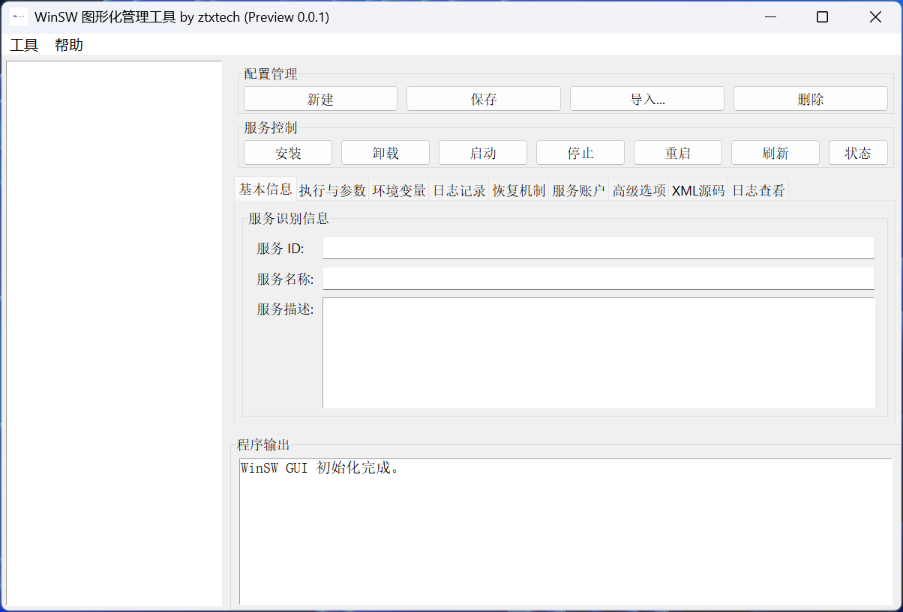

# 🚀 WinSW 图形化管理工具 (WinSW GUI) by ztxtech

> 告别繁琐的XML手动配置和命令行操作！拥抱专为 [WinSW](https://github.com/winsw/winsw) 打造的、功能强大且直观的图形化管理工具。


这不仅仅是一个配置生成器，更是一个集 **服务创建、编辑、控制、日志查看**
于一体的一站式管理平台。无论你是初次接触WinSW的新手，还是寻求效率提升的专家，这款工具都将成为你的得力助手。

## ✨ 界面概览



## 核心特性

* **✍️ 直观的图形化配置**:

    * 通过图形界面轻松管理服务的ID、名称、描述。
    * 可视化设置可执行文件、工作目录和启动参数。
    * 支持为服务添加、修改、删除环境变量。
    * 灵活配置日志模式（滚动、追加、忽略等）和路径。
    * 精细化管理服务账户、失败恢复策略、进程优先级等高级选项。

* **⚡️ 一站式服务控制**:

    * 集成 **安装、卸载、启动、停止、重启、刷新、状态查询** 等所有常用控制命令，一键触达。
    * 操作前智能确认，防止误操作。
    * 所有命令的输出实时显示在内置的程序控制台中。

* **📜 内嵌实时日志查看器**:

    * 无需打开文件，直接在软件内 **实时查看** 服务的 `wrapper.log` (包装器日志)、`out.log` (标准输出) 和 `err.log` (
      错误输出)。
    * 支持日志文件的 **一键清除**，方便调试。

* **☁️ WinSW 自动管理**:

    * 内置WinSW最新v3版本的 **自动下载** 功能，无需手动寻找和下载 `WinSW.exe`。
    * 支持使用自动管理的WinSW或指定本地的自定义版本。

* **📦 开箱即用**:

    * 提供已打包的 `.exe` 文件，无需安装Python环境，下载即用。
    * 所有配置和服务信息均保存在本地，绿色便携。

## 快速开始

### 方式一：直接下载 (推荐普通用户)

1. 前往本项目的 [**Releases**](https://github.com/ztxtech/winsw_GUI/releases) 页面。
2. 下载最新版本的 `WinSW_GUI.exe` 文件。
3. 直接运行，开始使用！

### 方式二：从源码运行 (推荐开发者)

1. **克隆本仓库**

   ```bash
   git clone https://github.com/ztxtech/winsw_GUI.git
   cd winsw_GUI
   ```

2. **安装依赖**

   ```bash
   pip install -r requirements.txt
   ```

3. **运行程序**

   ```bash
   python main.py
   ```

## 使用说明

1. **新建服务**: 点击“新建”按钮，清空当前界面。
2. **填写配置**: 在右侧的各个Tab（基本信息、执行与参数、日志记录等）中填写你的服务配置。
3. **保存配置**: 点击“保存”按钮，一个以服务ID命名的 `.xml` 文件将被创建在 `services` 文件夹中。
4. **管理服务**: 选中左侧列表中的服务后，即可使用“安装”、“启动”、“停止”等按钮来控制你的Windows服务。
5. **查看日志**: 在“日志查看”Tab中实时监控服务的运行日志。

## 开发与构建

想要自己修改代码或重新打包？没问题！

1. **环境依赖**:

    * Python 3.x
    * `requests`
    * `pyinstaller` (用于打包)

2. **自定义图标**:

    * 将你的 `.png` 图标文件命名为 `ztxtech.png` 并放置在 `etc/icon/` 目录下。

3. **打包成EXE**:

    * 在项目根目录下运行以下命令：

   <!-- end list -->

   ```bash
   pyinstaller --name "WinSW_GUI" --onefile --windowed --icon="etc/icon/ztxtech.png" --add-data "etc;etc" main.py
   ```

    * 打包好的可执行文件将出现在 `dist` 文件夹中。

## 未来计划

我们致力于让这款工具变得更好，未来的开发路线图可能包括：

- [ ] **多语言支持 (i18n)**，方便不同国家的用户。
- [ ] **主题切换**，例如增加深色模式。
- [ ] **服务状态自动刷新**，在列表中实时显示服务运行状态。
- [ ] **更丰富的服务模板**，一键创建常用类型的服务。

欢迎通过 [Issues](https://github.com/ztxtech/winsw_GUI/issues) 提出你的宝贵建议！

## 许可证

本项目基于 [MIT License](https://github.com/ztxtech/winsw_GUI/blob/main/LICENSE) 开源。

-----